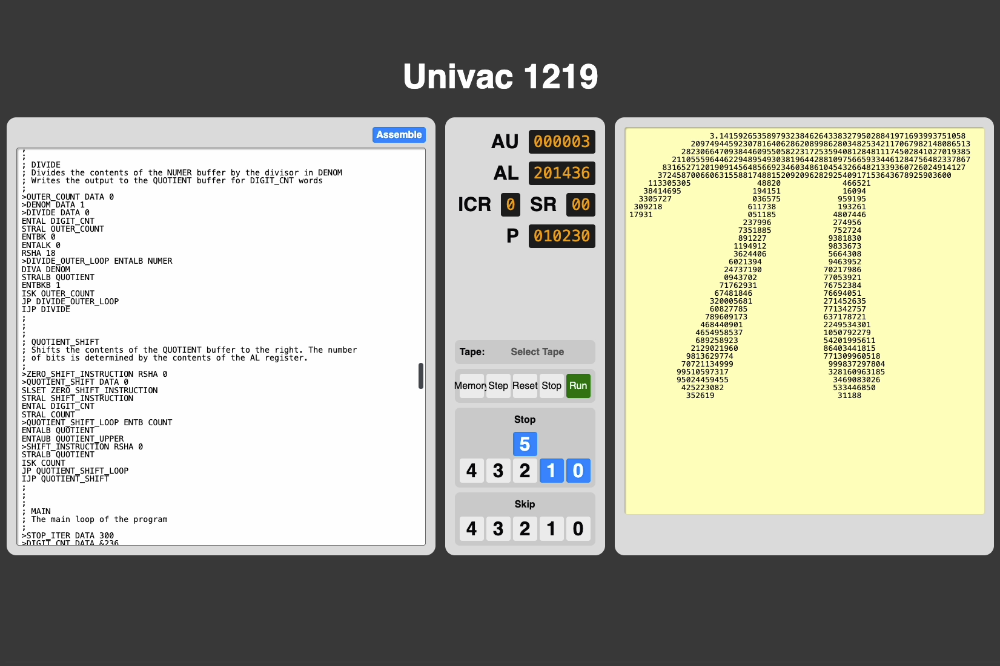

# UNIVAC 1219 Assembler and Emulator

This is an assembler and emulator for the UNIVAC 1219 computer at the [InfoAge museum](https://www.infoage.org/) in Wall, NJ.

These rust-based tools were inspired by the emulator and assembler [originally written](https://archive.org/details/univac-1219-emulator) by Duane B. Craps. The goals of this project are improved speed, more accurate emulation, and a simplified coding experience.

The C toolchain and C programs can be found [here](https://github.com/nathanfarlow/univac-1219-riscv).

For more information about the computer and details about programming it, please refer to the scanned manuals on [bitsavers](http://www.bitsavers.org/pdf/univac/military/1219/).

## For more information on this project, see the video [here](https://www.youtube.com/watch?v=rU8sCbwB8XU)



## Emulator Usage

The emulator is configured by default to use the provided [memory image](./data/MEMORY.0) and initially jump into the tape bootloader. Tape images can be provided, either directly in the `.76` "bioctal" format.

```
cargo run --release --bin emulator  --  --tape-file examples/CTEST3.76
```
Or by pointing to a source file in UNIVAC assembly, in which case a tape image will be generated by the assembler, and then provided to the emulator.
```
cargo run --release --bin emulator -- --source-file examples/PI.TXT --stop 0
```

Some programs are already present in the provided memory image and do not require a tape image to be loaded. Instead, the emulator can be pointed to their start address (written in octal) on startup.
```
cargo run --release --bin emulator  --  --start-address 001000
```
Some notable memory addresses are:

- `540` The tape bootloader
- `1000` A "Hello World" program
- `2000` A program which reads stdin and puts the most recent character into the `AL` register
- `70000` A memory monitor (also buildable from `CTEST3` in the [examples](./examples/CTEST3.TXT)) For instructions on how to use it, refer to the docs included [here](https://archive.org/details/univac-1219-emulator).

**Note:** To avoid assertions made by the [ux](https://crates.io/crates/ux) crate, always run the emulator in the `--release` profile.

### Other Flags
On modern hardware, this emulator can run hundreds of times faster than the original UNIVAC. The emulator can instead pause occasionally to more accurately match the original hardware by passing the `--realtime` or `-r` flag.

For more information when debugging, the `--verbose` (`-v`) flag can be passed to view an instruction trace of the emulator.

## Assembler Usage

Programs can be written as TXT files in UNIVAC assembly. See some examples [here](./examples/). Normally, assembly into a tape image can be performed on startup by the emulator, though the assembler can be used directly to store this tape image to a `.76` file in the "bioctal" format.
```
cargo run --release --bin assembler -- examples/PI.TXT
```
By default, a program `NAME.TXT` will be assembled to `NAME.76`, though this can be configured with the `--output-file` (`-o`) argument. Setting this to a USB serial device will attempt to load for the LECPAC serial bootloader (should you be directly connected to the machine :) 

To view a program listing, including a label table, the `--verbose` (`-v`) flag can be passed.

## Web-UI Usage

A web-app version of the emulator is provided in the `web/` directory. For more information, consult the [README](web/README.md).

## Disassembler

An experimental disassembler is provided which can attempt to parse tape files stored in the `.76` or `.BIN` formats. The disassembler will attempt to identify subroutines, strings, arrays, and addressed data.

`cargo run --release --bin disassembler -- examples/PI.76`

## Limitations
This emulator is a work in progress, so some features are not yet available, and some emulation details are inaccurate. These include

- Not all instructions have been implemented
- Not all instruction flags are implemented
- Assembler error messages are not that great, though the assembler does include the necessary information to add this in the future
- The emulator has no UI to interrupt emulation or monitor registers/memory while a program is running. These can be added manually. (See the [memory](./src/memory.rs) module for some helper functions)
